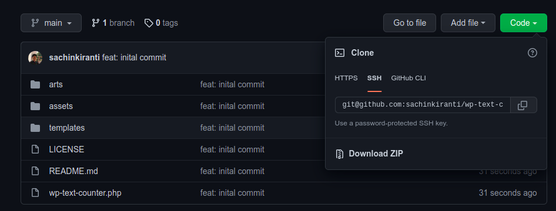
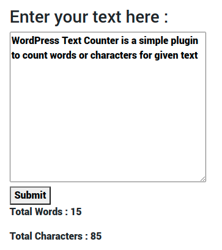

This plugin simply count the number of words and characters.

## Installation

Download the zip file of the repository or clone the repository in your *wp-content/plugins*

1. Download the zip file

    As traditionally upload the plugin to your wordpress site and activate :smiley: .

    

2. Clone the repository
    
    ```git
    git clone git@github.com:sachinkiranti/wp-text-counter.git
    ```
   
    Activate it!

## Usage

Add the shortcode to wordpress POST/PAGE or anywhere you want to :

```
[wp-text-counter title="Enter your text here :" ]
```

The Output of the above shortcode :



## License
The Plugin is open-sourced software licensed under the [GNU license](LICENSE).

I would love if you could email me and tell me about your project and how this code was used :smiley: